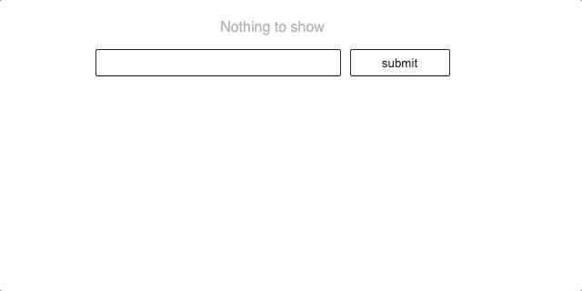

# WC3 - chatbot

Het doel van dit werkcollege is het schrijven van een kleine chat applicatie, via een JSON file. 

## stappen

1. Je zal natuurlijk moeten beginnen met het opvangen van de input van de user. zorg voor een eventlistener die een form submit opvangt
1. Hierna kan je het ingestuurde bericht toevoegen aan de JSON
1. Na het toevoegen van een bericht moet je dit natuurlijk weergeven. Zorg dat je dit pas doet na toevoeging.
1. Indien je vorige stappen hebt afgerond, kan je beginnen aan het implementeren van een uiterst simpele chatbot
   1. In de data file kan je mogelijke antwoorden toevoegen op basis van bepaalde woorden
   1. Je filtert de lijst van responses indien een woord voorkomt in de zin die de user heeft toegevoegd (google hoe je een string kan zoeken in een langere string)
   1. Kies een random antwoord uit de gefilterde lijst van antwoorden
   1. Voeg dit bericht toe aan de lijst van messages
   1. Na een korte timeout geef je dit weer aan de user